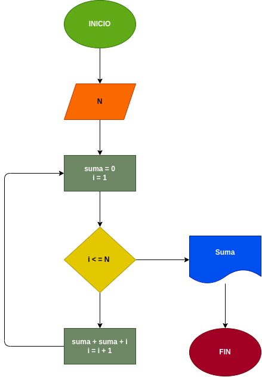

# N_Prieros_Naturales
suma el numero natural que nosotros le indiquemos 

---

# Analisis

Variables de entrada (imput)

- N : el numero que se realisara la suma

Variables de Proceso y salida (Prossesing,Storage, Output)

- Suma : el resultado de la operacion de N

- i : varable que suma todos los numeros ingresados

# Diseño

